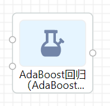

# AdaBoost回归

AdaBoost回归属于算法组件中机器学习的一种回归组件。可以在“公共组件-算法设计-机器学习-回归”的目录中找到它。

# **原理**

adaboost算法原理见

# 使用

将组件拖至项目中，与其他对应组件相连，即可运行

- 输入
    - 输入1：训练数据，支持CSV
    - 输入2：其他模型
- 输出：adaboost模型

# 参数

- **n_estimators :整数，默认为50**

boost终止时的最大estimator数量。在完全吻合的情况下，学习过程提前停止。

- **learning_rate : 浮点数，默认为1**

学习率

- **loss : {‘linear’, ‘square’, ‘exponential’}, 默认为’linear’**

每次boost迭代后更新权重时使用的损失函数

- **random_state : 整数**

# 参考文献

[sklearn.ensemble.AdaBoostRegressor - scikit-learn 0.21.3 documentation](https://scikit-learn.org/stable/modules/generated/sklearn.ensemble.AdaBoostRegressor.html#sklearn.ensemble.AdaBoostRegressor)

[AdaBoost](https://en.wikipedia.org/wiki/AdaBoost)

[adaboost_百度百科](https://baike.baidu.com/item/adaboost/4531273?fr=aladdin)