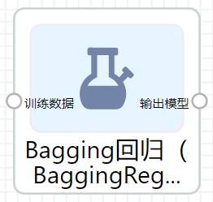

# Bagging回归

Bagging回归属于算法组件中机器学习的一种回归组件。可以在“公共组件-算法设计-机器学习-回归”的目录中找到它。

# 原理

原理详见

# 使用

将组件拖至项目中，与其他对应组件相连，即可运行

- 输入：训练数据，支持CSV
- 输出：逻辑回归模型

# 参数

- **n_estimators : 整型，默认为10**

集合中的base模型数。

- **max_samples : 整型或浮点型，默认为1.0**

要从X中抽取样本数来训练每个base模型。如果为整数，则抽取`max_samples` 个样本。如果为浮点数，则抽取`max_samples * X.shape[0]` 个样本。

- **max_features : 整型或浮点型，默认为1.0**

要从X中抽取样本数来训练每个base模型。如果为整数，则抽取`max_features` 个特征。如果为浮点数，则抽取`max_features * X.shape[1]` 个特征。

- **bootstrap : 布尔值，默认为True**

样品是否用有放回的抽取。如果为假，则执行不放回的采样。

- **bootstrap_features : 布尔值，默认为False**

是否用采用有放回的方式抽取特征。

- **oob_score : 布尔值，默认为False**

是否使用袋外样本来估计泛化误差。

- **warm_start : 布尔值，默认为False**

当设置为True时，重复使用先前调用的解决方案来拟合并向集合添加更多的估计器，否则，只需拟合一个全新的集合。

- **n_jobs : 整型**

并行数

- **random_state : 整型**
- **verbose : 整型，默认为0**

控制拟合和预测时的详细程度。

# 参考文献

[sklearn.ensemble.BaggingRegressor - scikit-learn 0.21.3 documentation](https://scikit-learn.org/stable/modules/generated/sklearn.ensemble.BaggingRegressor.html#sklearn.ensemble.BaggingRegressor)

[Bagging算法](https://zh.wikipedia.org/zh-hans/Bagging%E7%AE%97%E6%B3%95)

[bagging_百度百科](https://baike.baidu.com/item/bagging)