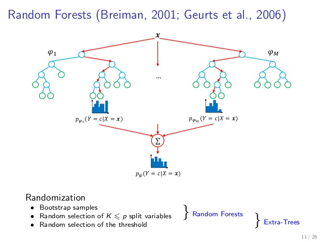
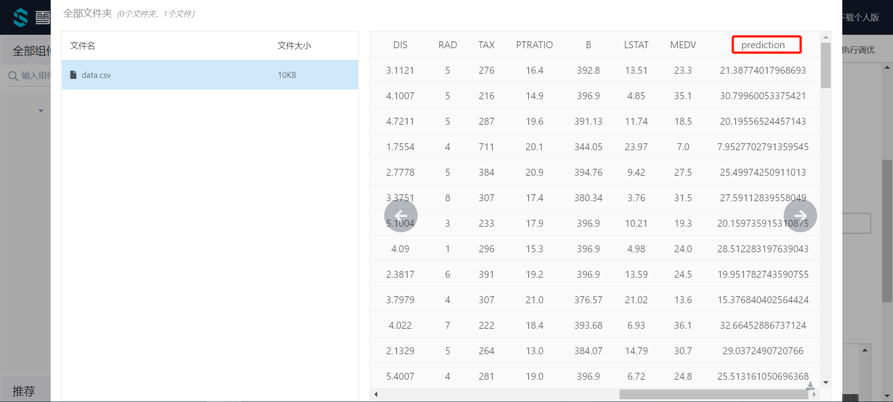

# ExtraTree回归

ExtraTree回归属于算法组件中机器学习的一种回归组件。可以在“公共组件-算法设计-机器学习-回归”的分类中找到它。

## 原理

ET或Extra-Trees（**Ext**remely **ra**ndomized trees，极端随机树）是由PierreGeurts等人于2006年提出。该算法与随机森林算法十分相似，都是由许多决策树构成。但该算法与随机森林有两点主要的区别：

1、随机森林应用的是Bagging模型，而ET是使用所有的训练样本得到每棵决策树，也就是每棵决策树应用的是相同的全部训练样本；

2、随机森林是在一个随机子集内得到最佳分叉属性，而ET是完全随机的得到分叉值，从而实现对决策树进行分叉的。

对于第2点的不同，我们再做详细的介绍。我们仅以二叉树为例，当特征属性是类别的形式时，随机选择具有某些类别的样本为左分支，而把具有其他类别的样本作为右分支；当特征属性是数值的形式时，随机选择一个处于该特征属性的最大值和最小值之间的任意数，当样本的该特征属性值大于该值时，作为左分支，当小于该值时，作为右分支。这样就实现了在该特征属性下把样本随机分配到两个分支上的目的。然后计算此时的分叉值（如果特征属性是类别的形式，可以应用基尼指数；如果特征属性是数值的形式，可以应用均方误差）。遍历节点内的所有特征属性，按上述方法得到所有特征属性的分叉值，我们选择分叉值最大的那种形式实现对该节点的分叉。从上面的介绍可以看出，这种方法比随机森林的随机性更强。

对于某棵决策树，由于它的最佳分叉属性是随机选择的，因此用它的预测结果往往是不准确的，但多棵决策树组合在一起，就可以达到很好的预测效果。

当ET构建好了以后，我们也可以应用全部的训练样本来得到该ET的预测误差。这是因为尽管构建决策树和预测应用的是同一个训练样本集，但由于最佳分叉属性是随机选择的，所以我们仍然会得到完全不同的预测结果，用该预测结果就可以与样本的真实响应值比较，从而得到预测误差。如果与随机森林相类比的话，在ET中，全部训练样本都是OOB样本，所以计算ET的预测误差，也就是计算这个OOB误差。

在这里，我们仅仅介绍了ET算法与随机森林的不同之处，ET算法的其他内容（如预测、OOB误差的计算）与随机森林是完全相同的，具体内容请看关于[随机森林](https://www.notion.so/df56552009f24634a5204859f81c315a)的介绍。

## 使用

将ExtraTree回归模块拖出，并找到想要使用的数据集与模型预测组件，分别与ExtraTree回归组件连接。

预测结束后可以点击模型预测的查看结果，可以看到最后的prediction为最终的预测结果。

## 参数

点击ExtraTree回归组件的参数设置选项，可以看到有许多参数可以手动设置。

criterion:用于计算分割质量的函数。“mse”，“mae”。

splitter:用于在每个节点上选择拆分的策略。“best”，“random”。

Max Depth:树的最大深度。

Min Samples Split:分割内部节点所需的最小样本数。

Min Samples Leaf:叶节点上所需的最小样本数。

Min Weight Fraction Leaf:叶节点(所有输入样本)所需权值之和的最小加权分数。

Max Features:在寻找最佳分割时要考虑的特性数量

Random State:随机种子。

Min Impurity Decrease:如果这个分裂导致杂质的减少大于或等于这个值，一个节点就会分裂。

Max Leaf Nodes:以最佳优先方式使用max_leaf_nodes生成树。

需要训练:该模型是否需要训练，默认为需要训练

## 参考文献

[ExtraTrees原理](https://blog.csdn.net/xbmatrix/article/details/69488867)

[sklearn.tree.ExtraTreeRegressor - scikit-learn 0.21.3 documentation](https://scikit-learn.org/stable/modules/generated/sklearn.tree.ExtraTreeRegressor.html#sklearn.tree.ExtraTreeRegressor)

[Extremely randomized trees - Geurts Pierre](https://orbi.uliege.be/handle/2268/9357)