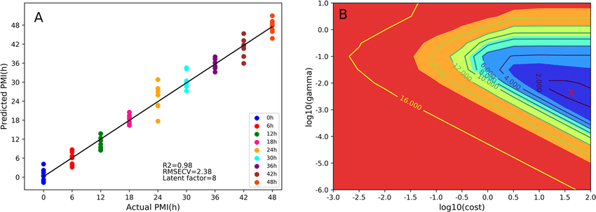
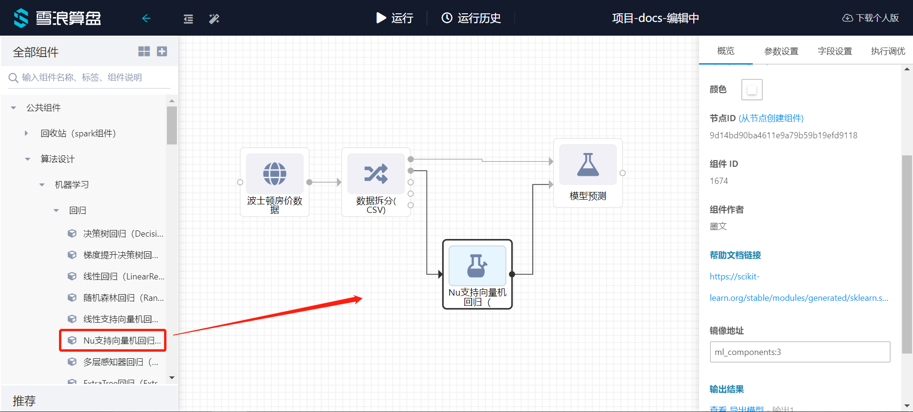
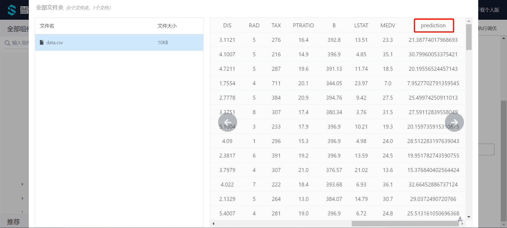
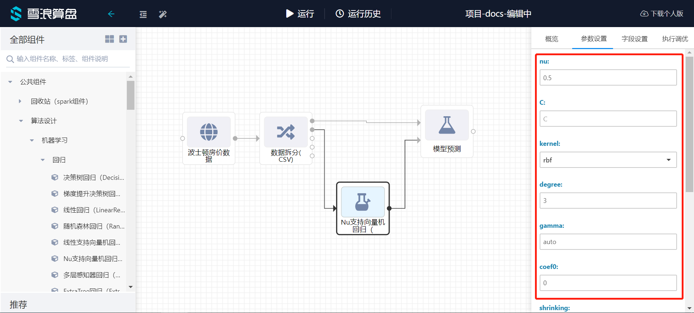

# Nu支持向量机回归

Nu支持向量机回归属于算法组件中机器学习的一种回归组件。可以在“公共组件-算法设计-机器学习-回归”的分类中找到它。

## 原理

在机器学习中，支持向量机(SVMs，也称为支持向量网络)是一种有关联学习算法的监督学习模型，支持分类和回归问题的数据建模。给定一组训练数据，每个样本属于一个或其他类别，用支持向量机算法构建并训练一个模型，将新样本分配到一个类别，使它成为一个非概率性二分类器。支持向量机模型是将样本表示为空间中的点，并将其映射，以便将不同类别的样本之间的间距尽可能大。然后，新的样本被映射到相同的空间中，并根据它们所处的位置，预测它们属于某个类别。

除了执行线性分类，支持向量机还可以通过使用核线方程有效地执行非线性分类，隐式地将它们的输入映射到高维特征空间。

当数据没有标记时，监督学习是不可能的，需要一种无监督学习方法，通过无监督学习试图找到数据到类别的自然聚类，然后将新数据映射到这些形成的类别。支持向量聚类算法是由Hava Siegelmann和Vladimir Vapnik共同创建的，它利用支持向量的统计量对未标注的数据进行分类，是工业应用中应用最广泛的聚类算法之一。

支持向量机回归有两个常用的版本，“epsilon-SVR”和“nu-SVR”。原始的SVM回归公式(SVR)使用参数C [0, inf]和epsilon[0, inf)对没有正确预测的点进行优化，从而产生惩罚。后来开发了两种SVM回归的替代版本，其中惩罚参数epsilon被另一个替代参数nu[0,1]所替代，该替代参数的惩罚略有不同。支持向量机nu版本的主要动机是它有一个更有意义的解释。这是因为nu表示训练样本中误差部分的上界和支持向量部分的下界。有些用户觉得nu比C或更直观。nu-SVM和C-SVM只是惩罚参数的不同版本。这两种情况都解决了相同的优化问题。

## 使用

将Nu支持向量机回归模块拖出，并找到想要使用的数据集与模型预测组件，分别与Nu支持向量机回归组件连接。

预测结束后可以点击模型预测的查看结果，可以看到最后的prediction为最终的预测结果。

## 参数

点击Nu支持向量机回归组件的参数设置选项，可以看到有许多参数可以手动设置。

**nu**（float）:训练误差分数的上界和支持向量分数的下界。(0, 1]

**C**（float）:误差项的惩罚参数C。

**kernel**:指定要在算法中使用的内核类型。‘linear’, ‘poly’, ‘rbf’, ‘sigmoid’, ‘precomputed’中的一种。

**degree**（int）:多项式核函数的次数(' poly ')。

**gamma**（float）:' rbf '， ' poly '和' sigmoid '的核系数

**coef0**（float）:核函数中的独立项。

**shrinking**（bool）:是否使用收缩启发式。

**tol**（float）:停止的容忍度。

**Cache Size**（float）:指定内核缓存的大小(以MB为单位)。

**verbose**（int）:启用详细输出。

**Max Iter**（int）:要运行的最大迭代数。

**需要训练**:该模型是否需要训练，默认为需要训练。

## 参考文献

[sklearn.svm.NuSVR - scikit-learn 0.21.3 documentation](https://scikit-learn.org/stable/modules/generated/sklearn.svm.NuSVR.html#sklearn.svm.NuSVR)

[Svm](http://wiki.eigenvector.com/index.php?title=Svm#epsilon-SVR_and_nu-SVR)