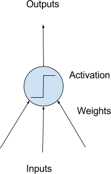

# 多层感知器回归

多层感知器回归属于算法组件中机器学习的一种回归组件。可以在“公共组件-算法设计-机器学习-回归”的分类中找到它。

## 原理

多层感知器(MLP)是一种前馈人工神经网络。MLP至少由三层节点组成:输入层、隐藏层和输出层。除输入节点外，每个节点都是一个神经元，使用非线性激活函数。MLP使用一种称为反向传播的监督学习技术进行训练。多层结构和非线性激活函数将MLP与线性感知器区分开来。它可以识别非线性可分的数据。

多层感知器有时被通俗地称为“vanilla”神经网络，尤其是当它们只有一个隐藏层时。

单个隐含层的MLP可以用图形表示如下:

神经网络的构建单元是人工神经元。这些是简单的计算单元，具有加权的输入信号，并使用激活函数产生输出信号。

你可能熟悉线性回归，在多层感知器中，输入的权重非常类似于回归方程中使用的系数。就像线性回归一样，每个神经元也有一个偏差，这个偏差可以被认为是一个输入，它的值总是1.0，而且它也必须加权。例如，一个神经元可能有两个输入，在这种情况下它需要三个权重。每个输入一个，偏置一个。

权重通常被初始化为小的随机值，比如0到0.3之间的值，尽管可以使用更复杂的初始化方案。与线性回归一样，权重越大，表示复杂性和脆弱性越高。在网络中保持权值较小，可以采用正则化技术。

加权输入被求和并需要通过一个激活函数传递，有时称为传递函数。激活函数是神经元加权输入和输出的简单映射。它被称为激活函数，因为它控制着神经元被激活的阈值和输出信号的强度。

历史上简单的阶跃激活函数的使用场景是当求和输入高于阈值(例如0.5)时，神经元将输出1.0，否则将输出0.0。

激活函数通常使用非线性激活函数。这使得网络能够以更复杂的方式组合输入，从而为它们能够建模的函数提供更丰富的功能。使用了一些非线性函数，如logistic函数(也称为sigmoid函数)，它输出的值在0到1之间，呈s形分布，双曲正切函数(也称为tanh)在-1到+1范围内输出相同的分布。

根据近年来的研究表明，ReLU作为激活函数有更好的效果。

## 使用

将多层感知器回归模块拖出，并找到想要使用的数据集与模型预测组件，分别与多层感知器回归组件连接。

预测结束后可以点击模型预测的查看结果，可以看到最后的prediction为最终的预测结果。

## 参数

点击多层感知器回归组件的参数设置选项，可以看到有许多参数可以手动设置。

隐藏层:第i个元素表示第i个隐藏层中的神经元数量。

激活函数:选择激活函数，{‘identity’, ‘logistic’, ‘tanh’, ‘relu’}。

solver:权重优化求解器。{‘lbfgs’, ‘sgd’, ‘adam’}。

alpha:L2正则项参数。

Batch Size:随机优化器的批大小。

Learning Rate:学习率权重更新。{‘constant’, ‘invscaling’, ‘adaptive’}。

Learning Rate Init:使用的初始学习率。

powerT:逆比例学习速率的指数。

最大迭代次数:最大迭代次数。

shuffle:是否在每次迭代中进行洗牌。

Random State:随机种子。

tol:优化器的容忍度。

verbose:是否将进度消息打印输出。

Warm Start:当设置为True时，重用前一个解决方案初始化，否则，只需擦除之前的解决方案。

momentum:梯度下降动量更新。

Nesterovs Momentum:是否使用Nesterov的动量更新。

Early Stop:当验证分数没有提高时，是否提早终止训练。

Validation Fraction:预留用于验证的训练数据的比例，用于提前停止。

beta1:adam中第一个矩向量估计的指数衰减率应该在[0,1]。

beta2:adam中二阶矩矢量估计值的指数衰减率应为[0,1]。

epsilon:数值稳定性在adam中的值。

N Iter No Change:不满足tol时的最大训练次数。

需要训练:该模型是否需要训练，默认为需要训练

## 参考文献

[sklearn.neural_network.MLPRegressor - scikit-learn 0.21.3 documentation](https://scikit-learn.org/stable/modules/generated/sklearn.neural_network.MLPRegressor.html)

[Multilayer perceptron](https://en.wikipedia.org/wiki/Multilayer_perceptron)

[多层感知器_百度百科](https://baike.baidu.com/item/%E5%A4%9A%E5%B1%82%E6%84%9F%E7%9F%A5%E5%99%A8/10885549)