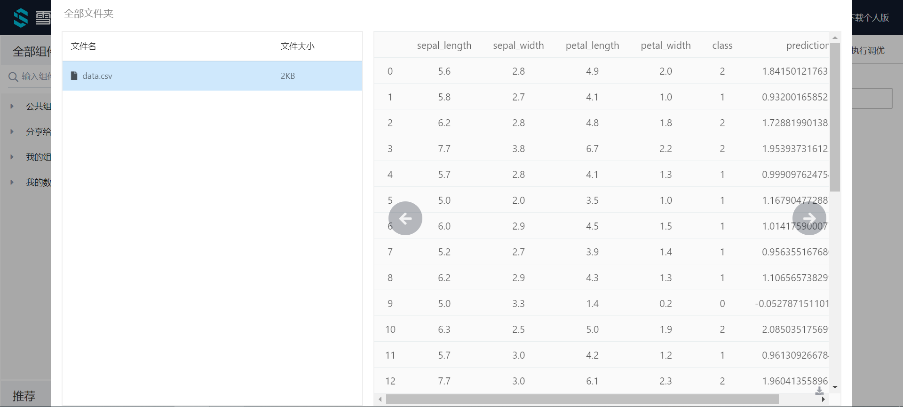

# 梯度提升决策树回归

梯度提升决策树回归属于算法组件中机器学习的一种回归组件。可以在“公共组件-算法设计-机器学习-回归”的分类中找到它。

## 原理

梯度增强是一种用于回归和分类问题的机器学习技术，它以弱预测模型(通常是决策树)集合的形式生成预测模型。它像其他增强算法一样，以阶段的方式构建模型，并通过允许优化任意可微分得损失函数来使模型通用化。

梯度增强的思想起源于Leo Breiman的观察，他认为梯度增强可以解释为一个合适的代价函数的优化算法。通过迭代选择一个指向负梯度方向的函数(弱假设)来优化函数空间上的代价函数的算法。这种函数梯度增强的观点导致了增强算法在机器学习和统计的许多领域的发展，包含了回归和分类领域。

Boosting算法实际上比较简单，它是一个循环过程。首先是用 Weak Learner 生成模型，然后再用 Weak Learner 去匹配前一次预测输出与实际值的残差，不断往复，最后的预测模型是所有这些 Weak Learner 预测模型的加和。

第一次模型F(x)的预测输出为y_pred, 第二次则使用x和y-y_pred去训练模型，模型为h(x)，实际预测的是第一次模型输出与实际值的残差，而这时整个预测模型为F(x)+h(x)

为什么 Boosting 算法总是要好一些呢？可以从原理上说明，损失函数在使用MSE时表示为

)%20%3D%20%5Cfrac%7B1%7D%7B2%7D(y%20-%20F(x))%5E2)

这里面F(x)是个变量，为了使损失变小，需要沿着梯度方向去更新F(x)

)

也就是在说使用MSE Loss的情况下，残差(Residual)是Loss对F的Gradient取负号。而H(x)=F(x)+h(x)视为对F(x)更新

%20%3D%20-%5Cfrac%7B%5Cpartial%20J%7D%7B%5Cpartial%7BF%7D%7D%20%3D%20y%20-F)

所以通过匹配残差实际就是在沿着梯度方向来降低Loss函数，这就是解释了Boosting算法为什么能升算法的预测准确度。

## 使用

将梯度提升决策树回归模块拖出，并找到想要使用的数据集与模型预测组件，分别与梯度提升决策树回归组件连接。

预测结束后可以点击模型预测的查看结果，可以看到最后的prediction为最终的预测结果。

## 参数

点击梯度提升决策树回归组件的参数设置选项，可以看到有许多参数可以手动设置。

**loss:**待优化的损失函数。可设置函数有{‘ls’, ‘lad’, ‘huber’, ‘quantile’}。

**Learning Rate**（float）**:**学习率通过learning_rate缩小了每棵树的贡献。

**N Estimators**（int）**:**要执行的boosting个数。

**subsample**（float）**:**用于拟合单个基础模型的样本比例。

**criterion:**用于测量分割质量的函数。支持标准有“mse“(均方根误差), “friedman_mse”（mean squared error with Friedman’s improvement score for potential splits）, “mae”（平均绝对误差）。

**Min Samples Split**（int or float）**:**分割内部节点所需的最小样本数。最小样本数或最小样本百分比

**Min Samples Leaf**（int or float）**:**叶节点上所需的最小样本数。任何深度的分歧点只在它在左右分支中留下至少min_samples_leaf训练样本时才会被考虑。这可能有平滑模型的效果，特别是在回归中。

**Min Weight Fraction Leaf**（float）**:**叶节点(所有输入样本)所需权值之和的最小加权分数。当不提供sample_weight时，示例具有相同的权重。

**Max Depth**（int）**:**单个回归器的最大深度。

**Min Impurity Decrease**（float）**:**如果分裂导致杂质的减少大于或等于这个值，一个节点就会分裂。

**init**（estimator）**:**用于计算初始预测的估计器对象。

**Random State**（int）**:**random_state是随机数生成器使用的种子。

**Max Features**（int, float, string）**:**在寻找最佳分割时要考虑的特征数量。数值型时为特征数量，浮点数为特征百分比。“auto”（max_features=n_features），“sqrt”（max_features=sqrt(n_features)），“log2”（max_features=log2(n_features)）。

**alpha**（float）**:**huber和quantile损失函数的alpha值。

**verbose**（int）**:**是否输出详细信息。

**Max Leaf Nodes**（int）**:**使用max_leaf_nodes以最佳优先方式生成树。

**Warm Start**（bool）**:**当设置为True时，重用前一个调用的解决方案用于训练并向集成算法添加更多的估计器，否则，删除前面的解决方案**。**

**presort**（bool）:是否对数据进行预压缩，以加快拟合中最佳分割的发现。

**Validation Fraction**（float）**:**预留用于验证的训练数据的比例，用于提前停止训练。

**N Iter No Change**（int）**:**n_iter_no_change用于判断在验证分数没有提高时是否使用early stop终止训练。

**tol**（float）**:**early stop的容忍度。

**需要训练:**该模型是否需要训练，默认为需要训练。

## 参考文献

[3.2.4.3.6. sklearn.ensemble.GradientBoostingRegressor - scikit-learn 0.21.2 documentation](https://scikit-learn.org/stable/modules/generated/sklearn.ensemble.GradientBoostingRegressor.html#sklearn.ensemble.GradientBoostingRegressor)

[Gradient Boosting算法](https://www.jianshu.com/p/79be776418bf)

[Gradient boosting](https://en.wikipedia.org/wiki/Gradient_boosting)