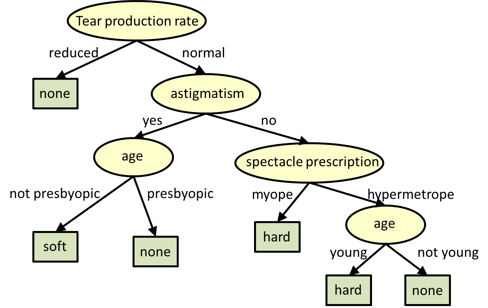

# 决策树回归组件

决策树回归属于算法组件中机器学习的一种回归组件。可以在“公共组件-算法设计-机器学习-回归”的分类中找到它。

## 原理

在计算机科学中，决策树学习使用决策树(作为预测模型)，从对项目的观察(用分支表示)到对项目目标值的结论(用叶子表示)。它是统计、数据挖掘和机器学习中常用的预测建模方法之一。目标变量可以取一组离散值的树模型称为分类树;在这些树结构中，叶子表示类标签，分支表示导致这些类标签的特征的连接。目标变量可以取连续值(通常是实数)的决策树称为回归树。

在决策分析中，决策树可以用来直观、明确地表示决策和决策制定。在数据挖掘中，决策树描述数据(但是产生的分类树可以作为决策的输入)。回归树分析是指预测的结果可以被认为是一个真实的数字(例如房价，或病人住院时间)。

决策树学习是从类标记的训练元组构造决策树。决策树是类似于流程图的结构，其中每个内部(非叶子)节点表示对属性的测试，每个分支表示测试的结果，每个叶子(或终端)节点持有一个类标签。树中最上面的节点是根节点。

有许多特定的决策树算法。值得注意的包括:

- [ID3](https://en.wikipedia.org/wiki/ID3_algorithm) (Iterative Dichotomiser 3)
- [C4.5](https://en.wikipedia.org/wiki/C4.5_algorithm) (successor of ID3)
- [CART](https://en.wikipedia.org/wiki/Predictive_analytics#Classification_and_regression_trees_.28CART.29) (Classification And Regression Tree)
- [Chi-square automatic interaction detection](https://en.wikipedia.org/wiki/Chi-square_automatic_interaction_detection) (CHAID). 在计算分类树时执行多级分割。
- [MARS](https://en.wikipedia.org/wiki/Multivariate_adaptive_regression_splines): 扩展决策树以更好地处理数值数据。
- Conditional Inference Trees. 基于统计的方法，使用非参数测试作为分裂准则，纠正多次测试，以避免过度拟合。该方法不需要剪枝，可以实现无偏预测器的选择。

## 使用

将决策树模块拖出，并找到想要使用的数据集与模型预测组件，分别于决策树回归组件连接。

预测结束后可以点击模型预测的查看结果，可以看到最后的prediction为最终的预测结果。

## 参数

点击决策树回归组件的参数设置选项，可以看到有许多参数可以手动设置。

**Criterion**（string）:用于测量分割质量的函数。支持标准有“mse“(均方根误差), “friedman_mse”（mean squared error with Friedman’s improvement score for potential splits）, “mae”（平均绝对误差）。

**splitter**（string）:用于在每个节点上选择拆分的策略。支持的策略是“best”选择最佳分割，“random”选择最佳随机分割。

**最大深度**（int）:树的最大深度。如果None，则展开节点，直到所有叶子都是纯的，或者直到所有叶子都包含小于min_samples_split样例。

**Min Samples Split**（int or float）:分割内部节点所需的最小样本数。最小样本数或最小样本百分比

**Min Samples Leaf**（int or float）:叶节点上所需的最小样本数。任何深度的分歧点只在它在左右分支中留下至少min_samples_leaf训练样本时才会被考虑。这可能有平滑模型的效果，特别是在回归中。

**Min Weight Fraction Leaf**（float）:叶节点(所有输入样本)所需权值之和的最小加权分数。当不提供sample_weight时，示例具有相同的权重。

**Max Features**（int, float, string）:在寻找最佳分割时要考虑的特征数量。数值型时为特征数量，浮点数为特征百分比。“auto”（max_features=n_features），“sqrt”（max_features=sqrt(n_features)），“log2”（max_features=log2(n_features)）。

**Random State**（int）:random_state是随机数生成器使用的种子。

**Max Leaf Nodes**（int）:以最佳优先方式使用max_leaf_nodes生成树。最佳节点定义为杂质的相对减少。如果没有，则无限数量的叶节点。

**Min Impurity Decrease**（float）:如果分裂导致杂质的减少大于或等于这个值，一个节点就会分裂。

**presort**（bool）:是否对数据进行预压缩，以加快拟合中最佳分割的发现。

**需要训练**:该模型是否需要训练，默认为需要训练

## 参考文献

[https://en.wikipedia.org/wiki/Decision_tree_learning](https://en.wikipedia.org/wiki/Decision_tree_learning)

[https://baike.baidu.com/item/%E5%86%B3%E7%AD%96%E6%A0%91/10377049?fr=aladdin](https://baike.baidu.com/item/%E5%86%B3%E7%AD%96%E6%A0%91/10377049?fr=aladdin)

[https://scikit-learn.org/stable/modules/generated/sklearn.tree.DecisionTreeRegressor.html](https://scikit-learn.org/stable/modules/generated/sklearn.tree.DecisionTreeRegressor.html)