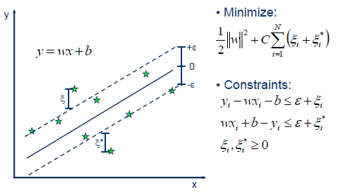
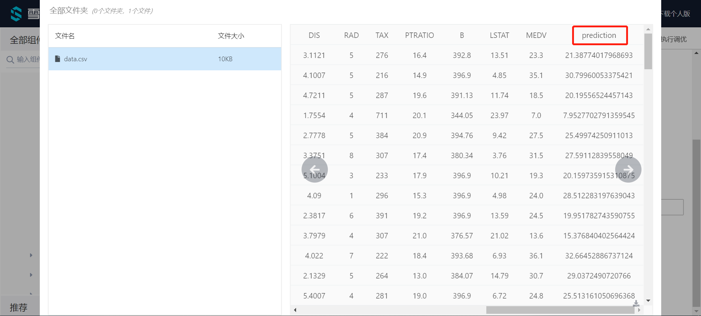

# 线性支持向量机回归

线性支持向量机回归属于算法组件中机器学习的一种回归组件。可以在“公共组件-算法设计-机器学习-回归”的分类中找到它。

## 原理

在机器学习中，支持向量机(SVMs，也称为支持向量网络)是一种有关联学习算法的监督学习模型，支持分类和回归问题的数据建模。给定一组训练数据，每个样本属于一个或其他类别，用支持向量机算法构建并训练一个模型，将新样本分配到一个类别，使它成为一个非概率性二分类器。支持向量机模型是将样本表示为空间中的点，并将其映射，以便将不同类别的样本之间的间距尽可能大。然后，新的样本被映射到相同的空间中，并根据它们所处的位置，预测它们属于某个类别。

除了执行线性分类，支持向量机还可以通过使用核线方程有效地执行非线性分类，隐式地将它们的输入映射到高维特征空间。

当数据没有标记时，监督学习是不可能的，需要一种无监督学习方法，通过无监督学习试图找到数据到类别的自然聚类，然后将新数据映射到这些形成的类别。支持向量聚类算法是由Hava Siegelmann和Vladimir Vapnik共同创建的，它利用支持向量的统计量对未标注的数据进行分类，是工业应用中应用最广泛的聚类算法之一。

支持向量机也可以作为回归方法，保持算法的所有主要特征(最大边缘算法)。支持向量回归(SVR)使用与支持向量机相同的原则进行分类，只有一些细微的差异。首先，因为输出是一个连续值，所以很难预测，因为它有无限种可能性。在回归的情况下，容忍度(epsilon)被设置为支持向量机的近似值，算法将更加复杂。然而，其主要思想始终是相同的:为了最小化误差，使超平面的类别间距最大化，但是部分误差是可以容忍的。

Linear SVR

## 使用

将线性支持向量机回归模块拖出，并找到想要使用的数据集与模型预测组件，分别与线性支持向量机回归组件连接。

预测结束后可以点击模型预测的查看结果，可以看到最后的prediction为最终的预测结果。

## 参数

点击线性支持向量机回归组件的参数设置选项，可以看到有许多参数可以手动设置。

**epsilon**（float）:epsilon-insensitive 损失函数中的Epsilon参数。

**tol**（float）:算法停止的容忍度。

**C**（float）:误差项的惩罚参数C。

**loss**:指定损失函数，squared_epsilon_insensitive和epsilon_insensitive可选。

**Fit Intercept**（bool）:是否计算该模型的截距。

**Intercept Scaling**（float）:为了减少正则化对合成特征权重(截距)的影响，必须增加Intercept Scaling。

**dual**（bool）:选择求解对偶优化问题或原优化问题的算法。

**verbose**（int）:启用详细输出。

**Random State**（int）:随机种子。

**Max Iter**（int）:要运行的最大迭代数。

**需要训练**:该模型是否需要训练，默认为需要训练。

## 参考文献

[sklearn.svm.LinearSVR - scikit-learn 0.21.3 documentation](https://scikit-learn.org/stable/modules/generated/sklearn.svm.LinearSVR.html)

[Support-vector machine](https://en.wikipedia.org/wiki/Support-vector_machine)

[支持向量机_百度百科](https://baike.baidu.com/item/%E6%94%AF%E6%8C%81%E5%90%91%E9%87%8F%E6%9C%BA/9683835?fr=aladdin)