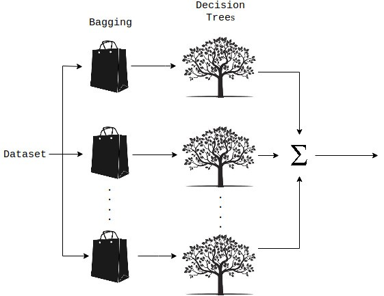

# 随机森林回归

随机森林回归属于算法组件中机器学习的一种回归组件。可以在“公共组件-算法设计-机器学习-回归”的分类中找到它。

## 原理

随机森林是一种集成的机器学习方法，能够使用多个决策树和统计技术（即bagging）执行回归和分类任务。Bagging和Boosting是两种最流行的集成技术，旨在解决高方差和高偏差。RF不只是对树的预测进行平均，它使用了两个关键概念，并因此得名random:

1. 建立决策树时使用训练样本的随机抽样结果
2. 分裂节点使用随机特征子集

换句话说，随机森林构建多个决策树，并将它们的预测合并在一起，从而获得更准确、更稳定的预测，而不是依赖于单个决策树。

随机森林中的每棵树都是从训练观察样本的随机抽样中学习。这些样本是通过有放回抽样取出，称之为bootstrapping，这意味着一些样本将在单个树中多次使用。这个想法是通过用不同的样本训练每棵树，虽然每棵树可能对特定的一组训练数据有很高的方差，但总体来说，整个森林的方差会更低，也不会以增加偏差为代价。在随机森林的Sklearn实现中，如果设置bootstrap=True，每棵树的子样本是通过有放回抽样取出，并且大小总是与原始输入相同，如果设置bootstrap=False，每棵树都将使用完全相同的数据集，没有任何随机性。

随机森林的另一个主要概念是，在决定拆分节点时，每棵树只能看到所有特征的子集。在Skearn中，这可以通过指定max_features = sqrt(n_features)来设置，这意味着如果每棵树的每个节点上有16个特性，那么将只考虑4个随机特征来分割节点。

随机森林的基本思想是将许多决策树的预测组合成一个模型。单独来看，决策树做出的预测可能并不准确，但综合起来，这些预测将更接近真实的平均值。

每棵树都有自己的信息源，因为它们在形成问题时考虑的是特征的随机子集，并且可以访问一组随机的训练数据点。如果我们只构建一棵树，我们将只利用它们有限的信息范围，但是通过将许多树的预测组合在一起，我们的净信息将会大得多。如果相反，每棵树都使用相同的数据集，那么每棵树都会受到异常或离群值的影响。

这增加了森林的多样性，导致了鲁棒性更强的整体预测。在进行预测时，随机森林回归模型会取所有决策树估计值的平均值。

## 使用

将随机森林回归模块拖出，并找到想要使用的数据集与模型预测组件，分别于随机森林回归组件连接。

预测结束后可以点击模型预测的查看结果，可以看到最后的prediction为最终的预测结果。

## 参数

点击随机森林回归组件的参数设置选项，可以看到有许多参数可以手动设置。

**N Estimators**（int）：森林中的树的个数。

**criterion**（str）：用于测量分割质量的函数。支持的标准是均值平方误差的“mse”和均值绝对误差的“mae”。

**Max Depth**（int）：树的最大深度。

**Min Samples Split**（int or float）：分裂节点所需的最小样本数。

**Min Samples Leaf**（int or float）：叶节点上所需的最小样本数。

**Min Weight Fraction Leaf**（int or float）：叶节点(所有输入样本)所需权值之和的最小加权分数。

**Max Features**（int or float or str）：在寻找最佳分割时要考虑的特征数量。“auto”，“sqrt”，“log2”。

**Max Leaf Nodes**（int）：使用max_leaf_nodes以最佳优先方式生成树。

**Min Impurity Decrease**（float）：如果分裂导致杂质的减少大于或等于这个值，一个节点就会分裂。

**bootstrap**（bool）：构建树时是否使用bootstrap样例。

**Oob Score**（bool）：是否使用袋外样品对未见数据进行R^2估计。

**N Jobs**（int）：拟合和预测并行运行的作业数。

**Random State**（int）：随机种子。

**verbose**（int）：控制拟合和预测时的信息是否可见。

**Warm Start**（bool）：当设置为True时，重用上一个调用的解决方案以适应并向其中添加更多的估计器，否则，拟合一个全新的随机森林。

**需要训练**（bool）:该模型是否需要训练，默认为需要训练。

## 参考文献

[3.2.4.3.2. sklearn.ensemble.RandomForestRegressor - scikit-learn 0.21.3 documentation](https://scikit-learn.org/stable/modules/generated/sklearn.ensemble.RandomForestRegressor.html#sklearn.ensemble.RandomForestRegressor)

[随机森林_百度百科](https://baike.baidu.com/item/%E9%9A%8F%E6%9C%BA%E6%A3%AE%E6%9E%97/1974765)

[Random forest](https://en.wikipedia.org/wiki/Random_forest)