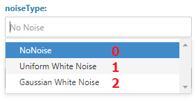
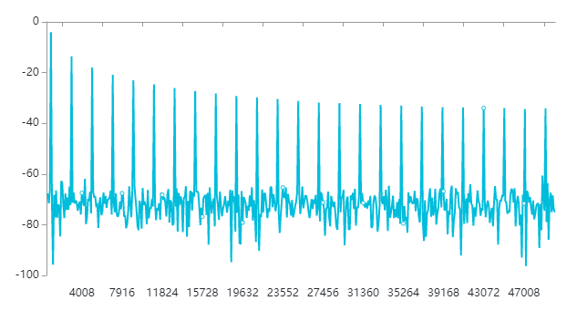

# 信号处理模块组件使用文档

本文档介绍算盘边缘计算信号处理组件使用方式。信号处理指的是各种类型的时序信号以及对信号进行提取、变换、分析、综合等处理过程。如下图可以看到本模块提供的大部分组件，主要分为信号的采集/生成，频域/时域分析、可视化组件。

一个算盘中的时域信号处理组件一般都有一对输入和输出，如下图。

**`metaData`**为一个JSON数据类型，包含此信号的一些属性，最重要的为其采样率`samplingRate`。**`samples`**为此信号的时域数据，内部使用的是Python的Numpy数据。

可以表示单通道或多通道时域数据，对应Numpy数组`shape`为(单个通道采样点数，通道数)。

## 信号采集组件

算盘提供多个信号采集组件用于连接数采硬件，实时获取如加速度传感器、音频传感器等等信号。

以声卡录音组件为例，如下图。

在右面板可以配置一些参数，如采样率、自动采样间隔、采样点数、手动配置声卡号（多声卡是可以指定）、自动检测并连接USB类型的声卡设备等。

runtimeConfig接受JSON类型数据，用于在运行状态下更新声卡录音配置，或触发声卡录音的动作。

例如：

触发一个声卡录音动作，

    { "force": true }

改变当前和后续所有单次采样的采样点数，

    { "numberOfSamples": 384000 }

## 信号仿真生成器组件

类似上列中的信号采集组件，信号仿真生成器组件可以不用连接数采硬件并按要求生成多种类型的信号。

信号仿真生成器组件`signalConfig`端子接收JSON数据。例如下面这段数据会触发信号仿真生成器组件输出一次仿真信号（force），信号幅值设定为3，叠加噪声类型1对应的是均匀白噪声。

     { "force": true, "amplitude": 3, "noiseType": 1, "samplePeriod": 0 }

信号叠加噪声类型

其他`signalConfig`支持的配置以及实例值可参考下表。

    {
      "force": false, # 固定值
      "samplePeriod": 1500, # 更新周期，单位毫秒，建议不改动，如果需要改动，建议不要在前面板改动，而是在启动前后面板“信号仿真生成器”节点配置。
      "signalType": 3, # 信号类型，0：正弦波，1：方波，2：三角波，3：锯齿波，4：直流信号，前面板需要做成三选一 radio buttons。
      "frequency":500, #频率，单位：Hz， 建议调节范围100~1000，前面板需要做成slider。
      "dutyCycle": 0.3, # 方波占空比，对其他信号类型无用，调节范围0~1，前面板显示为百分比（0%~100%），前面板需要做成slider。
      "phase": 60, # 相位平移，单位：角度，调节范围0~360，前面板需要做成slider。
      "noiseType": 2, # 噪声类型： 建议不要更改。
      "noiseSettings": 0.2 # 噪声强度，调节范围0.01~1，前面板需要做成slider。
    }

## 如何显示波形

下列简单的实例，展示了如何将生成的信号波形显示在前面板上。

前面板中的线/柱图会显示如下。

## 如何对时域信号作FFT转换并可视化

下列简单的实例，展示了如何对生成的信号做FFT计算然后显示在前面板上。

您可以再计算FFT组件中配置傅里叶变换长度。“Npy数组转字符串组件”将Numpy数据转化为字符串发送到前端“线/柱图”组件显示。

当信号生成器生成一个频率为1KHz，采样率为100KHz并叠加了少量高斯噪声的方波，前面板中的线/柱图会显示如下FFT图。

## 如何显示信号频谱

下列简单的实例，展示了如何对生成的信号做短时傅里叶（STFT）频谱计算然后显示在前面板上。算盘提供了包括梅尔频谱和短时傅里叶（STFT）频谱在列的多种频谱选择，使用操作类似。

“计算信号频谱”组件中可以配置短时傅里叶（STFT）频谱计算使用的窗口宽度和跳跃长度，如下图所示。

"渲染频谱"将频谱数据渲染为一张图片，可以配置如下参数。`Dark`选项用于适应前端黑暗背景样式。

当信号生成器生成一个频率为1KHz，采样率为100KHz并叠加了少量高斯噪声的方波，前面板中的线/柱图会显示如下频谱图。横坐标为时间轴，纵坐标为频率轴，标尺根据配置不同，可以为线性、对数、Hz或不显示。

